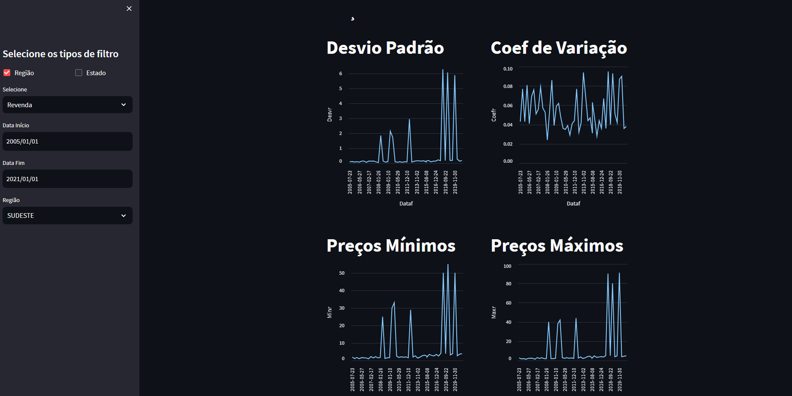
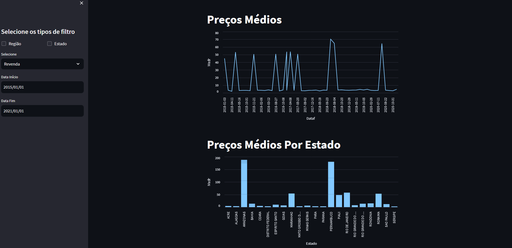

## Preview

## Colunas:
- Data Inicial (0)
- Data Final (1)
- Região (2)
- Estado (3)
- Produto (4)
- Número de postos pesquisados (5)
- Unidade de Medida (6)
- Preço médio revenda (7)
- Desvio padrão revenda (8)
- Preço mínimo revenda (9)
- Preço máximo revenda (10)
- Margem média revenda (11)
- Coef de variação revenda (12)
- Preço médio distribuição (13)
- Desvio padrão distribuição (14)
- Preço mínimo distribuição (15)
- Preço máximo distribuição (16)
- Coef de variação distribuição (17)

## Filtros barra lateral
- Seleção por Revenda/Distribuição (Side)
-      ==     Data (Side)
-      ==     Região (Side)
-      ==     Estado (Side)

## Informações plotadas (R : Revenda | D : Distribuição)
- Preço Médio (R, D)
- Desvio Padrão (R, D)
- Preço Mínimo (R, D)
- Preço Máximo (R, D)
- Margem Média (R)
- Coeficiente de variação (R, D)

